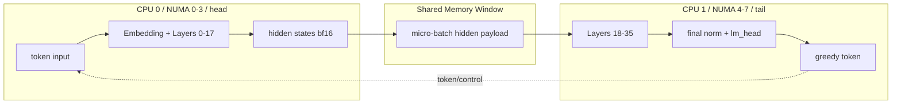

# Pipeline Brick 双卡 CPU 推理实验报告

## 1. 实验目标

本实验验证 Pipeline Brick 在双飞腾 CPU、单 Linux 系统上的多请求推理效果。对比对象为原始 llama.cpp 的 `llama-parallel`。实验包含两组场景：短 prompt、batch=2；长 prompt、batch=4。两组对比均使用相同模型、相同 prompt、相同生成长度 64 token/request。

本次改造后的 Pipeline Brick 包含三点：

- 按层切分：head 进程执行 Qwen3-4B 的 layers `[0,18)`，tail 进程执行 layers `[18,36)`。
- micro-batch（微批，即一次把多个 token/sequence 打包进入流水线）：prefill 阶段按 chunk 合批，decode 阶段把 2 条 sequence 的当前 token 合批。
- bf16 hidden states（bfloat16 隐藏状态，即 head 到 tail 的中间激活用 16 位浮点传输）：每 token 传输量从 10240 bytes 降到 5120 bytes。

## 2. 硬件与运行结构

实机为单 Linux 系统下的双 CPU / 8 NUMA：

- 第一张卡：NUMA `0-3`，CPU `0-63`，运行 head 进程。
- 第二张卡：NUMA `4-7`，CPU `64-127`，运行 tail 进程。
- head -> tail 使用 mmap shared window 模拟跨卡 Memory Window。
- tail -> head 只回传 token/control 小消息。

当前版本不是 llama.cpp RPC，也不是 TCP 通信。它在单系统模式下使用共享内存窗口和轮询 doorbell 语义模拟 CXL/NTB 的低开销传输路径。



## 3. 流水线时序

改造前的公平版按单 token 传输，prompt=287、batch=2 时 prefill 需要约 `287 x 2 = 574` 次小任务，开销很大。改造后 `--prefill-chunk 32`，每个 prefill micro-batch 最多包含：

```text
parallel x prefill_chunk = 2 x 32 = 64 tokens
```

因此 574 个 prompt token 被切成：

```text
8 x 64 + 62 = 574 tokens
```

时序示意：

```text
time      t0        t1        t2        t3        ...

head      MB0  ---> MB1  ---> MB2  ---> MB3  ---> ...
           |         |         |         |
           v         v         v         v
tail      recv MB0  recv MB1  recv MB2  recv MB3  ...

MB0 = seq0/seq1 的 prompt token 0-31
MB1 = seq0/seq1 的 prompt token 32-63
...
decode MB = seq0 当前 token + seq1 当前 token
```

这种方式保留了分层流水线，同时避免每个 CPU 一次只处理一个 token。

## 4. 测试命令

### 4.1 原始 llama.cpp baseline

```sh
mkdir -p bench-logs

/usr/bin/time -p -o bench-logs/baseline_parallel2.time \
./build/bin/llama-parallel \
  -m models/qwen3-4b/Qwen_Qwen3-4B-Instruct-2507-Q4_K_M.gguf \
  -ngl 0 \
  -t 128 \
  -c 4096 \
  -n 64 \
  -np 2 \
  -ns 2 \
  -p "请用三句话介绍一下 llama.cpp 是什么。" \
  --top-k 1 \
  > bench-logs/baseline_parallel2.out \
  2> bench-logs/baseline_parallel2.log
```

参数说明：

| 参数 | 含义 |
| --- | --- |
| `-ngl 0` | 纯 CPU 推理，不使用 GPU |
| `-t 128` | 原始 baseline 使用 128 个线程，即两张 CPU 的全部核心资源 |
| `-c 4096` | 上下文窗口，满足 2 个 client 加系统 prompt 的需求 |
| `-n 64` | 每条请求生成 64 token |
| `-np 2` | 同时模拟 2 个并行 client |
| `-ns 2` | 总共处理 2 条请求 |
| `--top-k 1` | top-1 贪心采样，降低随机性 |

### 4.2 Pipeline Brick micro-batch + bf16

```sh
mkdir -p bench-logs

/usr/bin/time -p -o bench-logs/pipeline_p2_microbf16.time \
./build/bin/llama-pipeline-brick \
  --single-system \
  --model models/qwen3-4b/Qwen_Qwen3-4B-Instruct-2507-Q4_K_M.gguf \
  --prompt "请用三句话介绍一下 llama.cpp 是什么。" \
  --ctx-size 2048 \
  --threads 64 \
  --n-predict 64 \
  --parallel 2 \
  --prefill-chunk 32 \
  --hidden-dtype bf16 \
  --quiet \
  --head-numa 0-3 \
  --tail-numa 4-7 \
  > bench-logs/pipeline_p2_microbf16.out \
  2> bench-logs/pipeline_p2_microbf16.log
```

参数说明：

| 参数 | 含义 |
| --- | --- |
| `--single-system` | 单 Linux 系统下 fork 出 head/tail 两个进程 |
| `--threads 64` | head 64 线程，tail 64 线程，总 CPU 资源与 baseline 对齐 |
| `--parallel 2` | 同时处理 2 条 sequence |
| `--prefill-chunk 32` | 每条 sequence 每次最多处理 32 个 prompt token |
| `--hidden-dtype bf16` | head -> tail 的 hidden states 使用 bf16 传输 |
| `--quiet` | 关闭逐 micro-batch 日志，避免日志影响性能 |
| `--head-numa 0-3` | head 绑定第一张卡 NUMA |
| `--tail-numa 4-7` | tail 绑定第二张卡 NUMA |

### 4.3 长 prompt batch=4 baseline

长 prompt 写入文件，避免命令行过长：

```sh
mkdir -p bench-logs prompts

cat > prompts/long_1k_prompt.txt <<'EOF'
请围绕 llama.cpp、CPU 大模型推理、NUMA 亲和性、流水线并行、KV cache 管理、prefill 和 decode 阶段的性能瓶颈，写一段技术分析。要求说明纯 CPU 推理为什么通常受内存带宽和矩阵乘法效率限制，说明长上下文下 KV cache 访问为什么会影响吞吐，说明多 sequence 并发时 batching 如何提高硬件利用率。然后进一步分析在双飞腾 CPU 系统中，将 Qwen3-4B 按层切分为 head Brick 和 tail Brick 的意义：head Brick 负责 embedding 和前 18 层，tail Brick 负责后 18 层、final norm 和 lm_head；两端之间只传 hidden states，不传完整 KV cache，也不通过 TCP 或 RPC。请解释这种方式相比单进程完整模型推理的潜在优势，包括两颗 CPU 同时工作、内存压力分散、每个 Brick 只维护本地层的 KV cache，以及通过 micro-batch 让 head 和 tail 在不同 token 批次上重叠执行。还要说明这种方案的局限，例如 hidden states 传输仍有开销，BF16 可以减少传输量但会带来格式转换，真实 CXL 或 NTB Memory Window 和 Doorbell 才能更接近硬件方案，当前 mmap shared memory 只能作为单系统验证。最后请用比较客观的语气总结：在 batch 较小、prompt 较短时，流水线并行可能被调度和传输开销抵消；在 prompt 较长、batch 较大、micro-batch 设置合理时，流水线并行才更可能体现优势。
EOF
```

baseline 命令：

```sh
/usr/bin/time -p -o bench-logs/baseline_parallel4_long1k.time \
./build/bin/llama-parallel \
  -m models/qwen3-4b/Qwen_Qwen3-4B-Instruct-2507-Q4_K_M.gguf \
  -ngl 0 \
  -t 128 \
  -c 8192 \
  -n 64 \
  -np 4 \
  -ns 4 \
  -f prompts/long_1k_prompt.txt \
  --top-k 1 \
  > bench-logs/baseline_parallel4_long1k.out \
  2> bench-logs/baseline_parallel4_long1k.log
```

### 4.4 长 prompt batch=4 Pipeline Brick

```sh
mkdir -p bench-logs

LONG_PROMPT="$(cat prompts/long_1k_prompt.txt)"

/usr/bin/time -p -o bench-logs/pipeline_p4_long1k_microbf16.time \
./build/bin/llama-pipeline-brick \
  --single-system \
  --model models/qwen3-4b/Qwen_Qwen3-4B-Instruct-2507-Q4_K_M.gguf \
  --prompt "$LONG_PROMPT" \
  --ctx-size 8192 \
  --threads 64 \
  --n-predict 64 \
  --parallel 4 \
  --prefill-chunk 32 \
  --hidden-dtype bf16 \
  --quiet \
  --head-numa 0-3 \
  --tail-numa 4-7 \
  > bench-logs/pipeline_p4_long1k_microbf16.out \
  2> bench-logs/pipeline_p4_long1k_microbf16.log
```

说明：当前 `llama-pipeline-brick` 尚未实现 `--prompt-file` 参数，因此 Pipeline Brick 侧用 shell 变量读取 prompt 文件，再通过 `--prompt "$LONG_PROMPT"` 传入。baseline 侧 `llama-parallel` 支持 `-f prompts/long_1k_prompt.txt`。

## 5. 实验结果

### 5.1 Baseline 结果

`baseline_parallel2.time`：

```text
real 47.08
user 3636.43
sys 926.12
```

`baseline_parallel2.log` 关键记录：

```text
n_parallel = 2, n_sequences = 2
prompt = 287
response = 64
Total prompt tokens: 574
Total gen tokens: 128
Total gen speed: 2.83 t/s
```

### 5.2 Pipeline Brick 结果

`pipeline_p2_microbf16.time`：

```text
real 37.25
user 2420.29
sys 52.97
```

`pipeline_p2_microbf16.log` 关键记录：

```text
pipeline-brick head: llama-parallel prompt template enabled, prompt tokens=287
pipeline-brick head: micro-batch max=64 prefill_chunk=32 hidden_dtype=bf16 bytes_per_token=5120
pipeline-brick tail: micro-batch max=64 prefill_chunk=32 hidden_dtype=bf16 bytes_per_token=5120
```

Debug 日志验证：

```text
sent prefill pos=0   n_tokens=64 bytes=328704 dtype=bf16
sent prefill pos=32  n_tokens=64 bytes=328704 dtype=bf16
...
sent prefill pos=256 n_tokens=62 bytes=318432 dtype=bf16
sent decode pos=287  n_tokens=2  bytes=10272  dtype=bf16
```

其中：

```text
64 x 5120 bytes hidden + 64 x 16 bytes metadata = 328704 bytes
```

说明 bf16 hidden states 和 micro-batch 均已生效。

### 5.3 对比结论

| 方案 | batch | prompt tokens/request | gen tokens total | real time | gen throughput |
| --- | ---: | ---: | ---: | ---: | ---: |
| llama-parallel baseline | 2 | 287 | 128 | 47.08 s | 2.72 tok/s |
| Pipeline Brick micro-batch + bf16 | 2 | 287 | 128 | 37.25 s | 3.44 tok/s |

计算：

```text
baseline throughput = 128 / 47.08 = 2.72 tok/s
pipeline throughput = 128 / 37.25 = 3.44 tok/s
speedup = 47.08 / 37.25 = 1.26x
```

结论：

```text
在 Qwen3-4B Q4_K_M、batch=2、prompt=287 token/request、生成 64 token/request、CPU-only 的设置下，
Pipeline Brick micro-batch + bf16 相比原始 llama-parallel baseline 端到端吞吐提升约 1.26x。
```

### 5.4 长 prompt batch=4 结果

本组实验使用相同长 prompt。`llama-parallel` 日志显示每条请求 prompt 为 643 token：

```text
n_parallel = 4, n_sequences = 4
prompt = 643
response = 64
Total prompt tokens: 2572
Total gen tokens: 256
Total gen speed: 2.60 t/s
```

baseline 计时结果：

```text
real 100.49
user 8046.93
sys 1390.54
```

Pipeline Brick 关键日志：

```text
pipeline-brick single-system: head NUMA=0-3 tail NUMA=4-7 window_size=42078208
pipeline-brick tail: micro-batch max=128 prefill_chunk=32 hidden_dtype=bf16 bytes_per_token=5120
pipeline-brick head: llama-parallel prompt template enabled, prompt tokens=643
pipeline-brick head: micro-batch max=128 prefill_chunk=32 hidden_dtype=bf16 bytes_per_token=5120
```

Pipeline Brick 计时结果：

```text
real 91.85
user 6939.97
sys 86.07
```

本组对比：

| 方案 | batch | prompt tokens/request | gen tokens total | real time | gen throughput |
| --- | ---: | ---: | ---: | ---: | ---: |
| llama-parallel baseline | 4 | 643 | 256 | 100.49 s | 2.55 tok/s |
| Pipeline Brick micro-batch + bf16 | 4 | 643 | 256 | 91.85 s | 2.79 tok/s |

计算：

```text
baseline throughput = 256 / 100.49 = 2.55 tok/s
pipeline throughput = 256 / 91.85 = 2.79 tok/s
speedup = 100.49 / 91.85 = 1.09x
```

这组结果说明：长 prompt、batch=4 时，Pipeline Brick 仍然快于原始 `llama-parallel`，但提升幅度从 batch=2 短 prompt 场景的约 1.26x 降到约 1.09x。原因可能是长 prompt 下 baseline 的连续 batching 效率更高，而 Pipeline Brick 仍存在 head -> tail hidden states 传输、bf16 转换和双进程同步开销。

## 6. 分析与边界

本次加速主要来自两个方面：

- micro-batch 将 prefill 从约 574 次小任务压缩为 9 个较大任务，显著降低图执行、同步和传输调度开销。
- bf16 hidden states 将 head -> tail 的层间激活传输量减半。

当前版本已经验证：

- 双进程 head/tail 分层推理闭环。
- NUMA 绑定：head 使用 CPU `0-63`，tail 使用 CPU `64-127`。
- prompt token 与 baseline 对齐，均为 287。
- hidden states 只在层间传输，KV cache 保留在本地层范围。

仍未实现的部分：

- 真实 CXL/NTB 驱动、DMA 和硬件 Doorbell 中断。
- 真正的 NUMA tensor parallel，本版本只是进程绑核。
- 动态 continuous batching 和请求到达/结束的在线调度。
- predictor 和 sparse attention。

因此，本实验结论适合作为当前原型的阶段性结果：Pipeline Brick 在 micro-batch 和 bf16 传输加入后，已经从功能验证版本进入可展示性能收益的版本；后续真实 CXL/NTB 和 DMA 化后，通信路径还可继续优化。

新增 batch=4 长 prompt 实验后，可以更谨慎地表述为：当前原型在两个测试场景中均优于原始 `llama-parallel`，但收益随场景变化明显。短 prompt、batch=2 场景约 1.26x；长 prompt、batch=4 场景约 1.09x。因此后续汇报时不应只强调最高加速比，更应该说明收益来自分层并行和 micro-batch 调度，同时承认 shared memory、bf16 转换和同步仍然是当前软件原型的主要开销。
