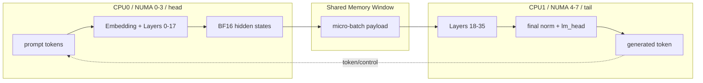

# Pipeline Brick F16 单 Domain 推理实验报告

## 1. 实验目标

本报告记录 Feibric 当前 F16 主实验口径下的单 Domain 推理结果, 并与原始 llama.cpp 的 `llama-parallel` baseline 进行公平对比。

本报告与旧 Q4_K_M 实验报告相互独立。旧报告仍保留在:

```text
docs/pipeline-brick-experiment-report.md
```

旧报告可作为模型精度对比材料, 但不应和本报告的 F16 结果直接混成同一个主结论。

本次主对比设置:

- 模型: `models/qwen3-4b-f16/Qwen3-4B-Instruct-2507-F16.gguf`
- 权重精度: F16 / FP16
- 运行模式: 单 Linux Domain, 双飞腾 CPU
- batch: 4
- prompt 文件: `prompts/long_1k_prompt.txt`
- prompt tokens/request: 643
- 生成长度: 64 token/request
- 总 prompt tokens: 2572
- 总生成 tokens: 256

## 2. 术语和公平性说明

F16 / FP16（16 位浮点权重格式, 即每个模型权重通常占 2 bytes）相比 Q4_K_M（4-bit 量化权重格式, 即大部分权重约用 4 bit 存储）会显著增加权重读取量。CPU-only 推理经常受内存带宽影响, 所以 F16 和 Q4_K_M 的速度不能直接横向评价算法优劣。

`llama-parallel`（llama.cpp 原始并发示例程序, 即不使用 Feibric pipeline 的单进程 CPU baseline）用于提供同步推理基线。

Pipeline Brick（分层流水线原型, 即把模型按层拆成多个推理进程）在本次单 Domain 实验中拆成 head 和 tail 两个 brick:

- head: embedding + layers `[0,18)`
- tail: layers `[18,36)` + final norm + lm_head

CXL / MCIO（域内 CPU 互联承载共享内存访问, 即同 Linux 系统内两颗 CPU 间通过硬件互联访问内存）在当前代码中对应 CXL/shared-window transport。这里不应说软件实现了 CXL 协议栈, 更准确说法是代码使用共享内存窗口和 NUMA 绑定, 跨 CPU 内存访问由当前硬件互联承载。

hidden states（隐藏状态, 即模型中间层输出的向量）是 head -> tail 之间传输的数据。本方案只传 hidden states, 不传完整 KV cache。

KV cache（键值缓存, 即 attention 为历史 token 保存的 K/V 张量）在 Pipeline Brick 中保存在各自负责的本地层范围内。head 维护前 18 层 KV cache, tail 维护后 18 层 KV cache。

BF16 / bfloat16（16 位脑浮点格式, 即 exponent 较宽的 16 位浮点格式）本实验只用于 stage 间 hidden states 传输, 不改变模型权重格式。Qwen3-4B 的 `n_embd=2560`, 因此每 token 的 hidden states 传输量为:

```text
F32:  2560 x 4 = 10240 bytes/token
BF16: 2560 x 2 = 5120 bytes/token
```

prefill（提示词预填充阶段, 即先处理输入 prompt 并建立 KV cache）在本实验中按 micro-batch 发送。

decode（逐 token 生成阶段, 即每一步生成一个新 token 并读写 KV cache）在本实验中每条请求生成 64 token。

micro-batch（微批, 即把多个 token/sequence 打包成一个较大的流水线任务）用于降低小任务调度和传输开销。本实验 `--parallel 4 --prefill-chunk 32`, 所以每次 prefill 最多打包:

```text
4 x 32 = 128 tokens
```

TP / Tensor Parallelism（张量并行, 即把同一层矩阵计算拆给多个 rank 后做规约求和）本次主结果没有启用。命令使用 `--tp-size 1`。日志里的 `numa_tp=4` 是旧 NUMA 绑核提示, 不代表 true TP=4 权重分片并行。

StreamingLLM / stream-kv（固定 sink tokens + recent tokens 的流式稀疏注意力策略）在本报告中作为单独消融项记录。dense Pipeline Brick 组没有添加 `--stream-kv --stream-kv-sink 16 --stream-kv-recent 128`, 因此仍是 dense attention（稠密注意力, 即每个 token 仍看完整历史上下文）路径; stream-kv 组则启用了 sink 16 + recent 128。

## 3. 硬件与运行结构

本实验使用一台双飞腾 CPU 机器:

- CPU0 / NUMA `0-3` / CPU `0-63`: Pipeline Brick head
- CPU1 / NUMA `4-7` / CPU `64-127`: Pipeline Brick tail
- head -> tail: 通过 CXL/shared-window transport 发送 BF16 hidden states
- tail -> head: 回传 token/control 小消息



## 4. 测试命令

### 4.1 公共准备

```sh
cd /root/yzw-test/llama5/llama.cpp
mkdir -p bench-logs

LONG_PROMPT="$(cat prompts/long_1k_prompt.txt)"
```

构建:

```sh
cmake --build build --target llama-pipeline-brick llama-parallel -j 64
```

### 4.2 llama-parallel F16 baseline

```sh
/usr/bin/time -p -o bench-logs/baseline_llama_parallel_f16.time \
./build/bin/llama-parallel \
  -m models/qwen3-4b-f16/Qwen3-4B-Instruct-2507-F16.gguf \
  -ngl 0 \
  -t 128 \
  -c 8192 \
  -n 64 \
  -np 4 \
  -ns 4 \
  -f prompts/long_1k_prompt.txt \
  --top-k 1 \
  > bench-logs/baseline_llama_parallel_f16.out \
  2> bench-logs/baseline_llama_parallel_f16.log
```

### 4.3 Pipeline Brick F16, 单 Domain, dense attention, TP=1

```sh
/usr/bin/time -p -o bench-logs/single_domain_pipeline_tp1.time \
./build/bin/llama-pipeline-brick \
  --domain-mode single \
  --transport cxl \
  --model models/qwen3-4b-f16/Qwen3-4B-Instruct-2507-F16.gguf \
  --prompt "$LONG_PROMPT" \
  --ctx-size 8192 \
  --threads 64 \
  --n-predict 64 \
  --parallel 4 \
  --prefill-chunk 32 \
  --hidden-dtype bf16 \
  --tp-size 1 \
  --head-numa 0-3 \
  --tail-numa 4-7 \
  --quiet \
  > bench-logs/single_domain_pipeline_tp1.out \
  2> bench-logs/single_domain_pipeline_tp1.log
```

### 4.4 Pipeline Brick F16, 单 Domain, stream-kv, TP=1

下面命令用于稀疏注意力消融。stream-kv（固定 sink tokens + recent tokens 的流式稀疏注意力策略）只改变注意力访问历史 token 的范围, 不是 AttentionPredictor。

```sh
/usr/bin/time -p -o bench-logs/single_domain_pipeline_tp1_stream.time \
./build/bin/llama-pipeline-brick \
  --domain-mode single \
  --transport cxl \
  --model models/qwen3-4b-f16/Qwen3-4B-Instruct-2507-F16.gguf \
  --prompt "$LONG_PROMPT" \
  --ctx-size 8192 \
  --threads 64 \
  --n-predict 64 \
  --parallel 4 \
  --prefill-chunk 32 \
  --hidden-dtype bf16 \
  --tp-size 1 \
  --stream-kv --stream-kv-sink 16 --stream-kv-recent 128 \
  --head-numa 0-3 \
  --tail-numa 4-7 \
  --quiet \
  > bench-logs/single_domain_pipeline_tp1_stream.out \
  2> bench-logs/single_domain_pipeline_tp1_stream.log
```

## 5. 实验结果

### 5.1 llama-parallel F16 baseline

用户提供日志关键记录:

```text
main: n_parallel = 4, n_sequences = 4, cont_batching = 1, system tokens = 273
Client 0, prompt 643 t, response 64 t, time 191.28 s, speed 3.70 t/s
Client 1, prompt 643 t, response 64 t, time 191.27 s, speed 3.70 t/s
Client 2, prompt 643 t, response 64 t, time 191.27 s, speed 3.70 t/s
Client 3, prompt 643 t, response 64 t, time 191.27 s, speed 3.70 t/s
Total prompt tokens:   2572, speed: 13.45 t/s
Total gen tokens:       256, speed:  1.34 t/s
Total speed (AVG):           speed: 14.78 t/s
Cache misses:             0
```

本报告采用 `191.27 s` 作为 baseline 端到端时间。后续正式归档时, 可再用 `bench-logs/baseline_llama_parallel_f16.time` 的 `real` 字段核对。

### 5.2 Pipeline Brick F16, dense attention, TP=1

用户提供日志关键记录:

```text
pipeline-brick single-system: head NUMA=0-3 tail NUMA=4-7 window_size=42078208
pipeline-brick transport: cxl slots=64 slot_size=657472 window_size=42078208
pipeline-brick tail: brick=1 peer=0 layers [18,36), parallel=4, n_embd=2560, numa_tp=4
pipeline-brick tail: micro-batch max=128 prefill_chunk=32 hidden_dtype=bf16 bytes_per_token=5120
pipeline-brick head: brick=0 peer=1 layers [0,18), parallel=4, n_embd=2560, numa_tp=4
pipeline-brick head: llama-parallel prompt template enabled, prompt tokens=643
pipeline-brick head: micro-batch max=128 prefill_chunk=32 hidden_dtype=bf16 bytes_per_token=5120
pipeline-brick perf: inference time 109.94 s
pipeline-brick perf: total prompt tokens 2572, speed 23.39 t/s
pipeline-brick perf: total gen tokens 256, speed 2.33 t/s
```

根据 `2828 total tokens / 109.94 s` 计算:

```text
pipeline total speed = 25.72 t/s
```

结果解释:

- `prompt tokens=643` 与 baseline 每条请求的 prompt token 数一致。
- `total prompt tokens 2572` 等于 `643 x 4`。
- `total gen tokens 256` 等于 `64 x 4`。
- `hidden_dtype=bf16 bytes_per_token=5120` 说明 head -> tail hidden states 使用 BF16 传输。
- 本次命令是 `--tp-size 1`, 所以不要标记为 true TP=4。
- 本次命令没有 `--stream-kv`, 所以不要标记为稀疏注意力。

### 5.3 Pipeline Brick F16, stream-kv, TP=1

用户提供日志关键记录:

```text
pipeline-brick single-system: head NUMA=0-3 tail NUMA=4-7 window_size=42078208
pipeline-brick transport: cxl slots=64 slot_size=657472 window_size=42078208
pipeline-brick tail: brick=1 peer=0 layers [18,36), parallel=4, n_embd=2560, numa_tp=4
pipeline-brick tail: micro-batch max=128 prefill_chunk=32 hidden_dtype=bf16 bytes_per_token=5120
pipeline-brick tail: stream-kv enabled sink=16 recent=128
pipeline-brick head: brick=0 peer=1 layers [0,18), parallel=4, n_embd=2560, numa_tp=4
pipeline-brick head: llama-parallel prompt template enabled, prompt tokens=643
pipeline-brick head: micro-batch max=128 prefill_chunk=32 hidden_dtype=bf16 bytes_per_token=5120
pipeline-brick head: stream-kv enabled sink=16 recent=128
pipeline-brick perf: inference time 96.53 s
pipeline-brick perf: total prompt tokens 2572, speed 26.64 t/s
pipeline-brick perf: total gen tokens 256, speed 2.65 t/s
pipeline-brick perf: total tokens 2828, speed 29.30 t/s
```

结果解释:

- `stream-kv enabled sink=16 recent=128` 说明稀疏注意力路径已启用。
- `sink=16` 表示保留开头 16 个 token 作为稳定注意力锚点。
- `recent=128` 表示保留最近 128 个 token 作为局部上下文窗口。
- 该策略不是 CNN AttentionPredictor, 也不是动态预测 hot tokens。
- 本次命令仍是 `--tp-size 1`, 所以不要标记为 true TP=4。

需要注意: `pipeline-brick perf` 中的 prompt speed 和 gen speed 都使用总 inference time 作为分母, 因此不能把 `26.64 t/s` 解释成纯 prefill 阶段速度。stream-kv 主要影响 decode 阶段的 attention 历史访问范围。

### 5.4 TP=4 smoke 诊断结果

用户此前运行过 `tp4_smoke` 小测试, 该测试用于判断 TP=4 路径是否死锁, 不作为主性能对比。

关键结果:

```text
pipeline-brick head: llama-parallel prompt template enabled, prompt tokens=279
pipeline-brick perf: inference time 112.26 s
pipeline-brick perf: total prompt tokens 279, speed 2.49 t/s
pipeline-brick perf: total gen tokens 1, speed 0.01 t/s
pipeline-brick perf: total tokens 280, speed 2.49 t/s
```

该结果说明 TP=4 smoke 可以走到最终 `pipeline-brick perf`, 因此不是初始化后必然死锁。但该测试使用短 prompt、`n-predict=1`、`parallel=1`, 不能和 batch=4 长 prompt主实验直接比较。

## 6. F16 主结果对比

| 方案 | 模型 | attention | TP | batch | prompt tokens/request | gen tokens total | 时间 | gen throughput |
| --- | --- | --- | --- | ---: | ---: | ---: | ---: | ---: |
| `llama-parallel` baseline | F16 | dense | 无 | 4 | 643 | 256 | 191.27 s | 1.34 tok/s |
| Pipeline Brick 单 Domain + CXL/shared-window + BF16 hidden | F16 | dense | `--tp-size 1` | 4 | 643 | 256 | 109.94 s | 2.33 tok/s |
| Pipeline Brick 单 Domain + CXL/shared-window + BF16 hidden + stream-kv | F16 | sink 16 + recent 128 | `--tp-size 1` | 4 | 643 | 256 | 96.53 s | 2.65 tok/s |

Pipeline Brick dense attention 相对 baseline 的端到端加速比:

```text
speedup = 191.27 / 109.94 = 1.74x
```

Pipeline Brick stream-kv 相对 baseline 的端到端加速比:

```text
speedup = 191.27 / 96.53 = 1.98x
```

stream-kv 相对 dense Pipeline Brick 的端到端加速比:

```text
speedup = 109.94 / 96.53 = 1.14x
```

按生成吞吐计算, dense Pipeline Brick 相对 baseline:

```text
gen throughput speedup = 2.33 / 1.34 = 1.74x
```

按生成吞吐计算, stream-kv Pipeline Brick 相对 baseline:

```text
gen throughput speedup = 2.65 / 1.34 = 1.98x
```

结论:

```text
在 F16 模型、长 prompt、batch=4、每请求生成 64 token 的设置下,
Pipeline Brick 单 Domain dense attention 方案相比原始 llama-parallel baseline,
端到端时间从约 191.27 s 降到 109.94 s,
生成吞吐从 1.34 tok/s 提升到 2.33 tok/s,
约为 1.74x。

在同一设置下加入 stream-kv 后,
端到端时间进一步降到 96.53 s,
生成吞吐提升到 2.65 tok/s,
相对 llama-parallel baseline 约为 1.98x,
相对 dense Pipeline Brick 约为 1.14x。
```

## 7. 与旧 Q4_K_M 报告的关系

旧 Q4_K_M 报告位于:

```text
docs/pipeline-brick-experiment-report.md
```

旧报告中长 prompt、batch=4 的结果为:

| 方案 | 模型 | batch | prompt tokens/request | gen tokens total | 时间 | gen throughput | speedup |
| --- | --- | ---: | ---: | ---: | ---: | ---: | ---: |
| `llama-parallel` baseline | Q4_K_M | 4 | 643 | 256 | 100.49 s | 2.55 tok/s | 1.00x |
| Pipeline Brick micro-batch + BF16 hidden | Q4_K_M | 4 | 643 | 256 | 91.85 s | 2.79 tok/s | 1.09x |

本报告中的 F16 结果为:

| 方案 | 模型 | batch | prompt tokens/request | gen tokens total | 时间 | gen throughput | speedup |
| --- | --- | ---: | ---: | ---: | ---: | ---: | ---: |
| `llama-parallel` baseline | F16 | 4 | 643 | 256 | 191.27 s | 1.34 tok/s | 1.00x |
| Pipeline Brick 单 Domain + CXL/shared-window + BF16 hidden | F16 | 4 | 643 | 256 | 109.94 s | 2.33 tok/s | 1.74x |
| Pipeline Brick 单 Domain + CXL/shared-window + BF16 hidden + stream-kv | F16 | 4 | 643 | 256 | 96.53 s | 2.65 tok/s | 1.98x |

模型精度带来的粗粒度影响:

```text
baseline: F16 time / Q4 time = 191.27 / 100.49 = 1.90x
pipeline dense: F16 time / Q4 time = 109.94 / 91.85 = 1.20x
```

当前没有同配置的 Q4_K_M + stream-kv 结果, 因此暂不计算 stream-kv 的 Q4/F16 精度对比。

从现有结果看, F16 权重会明显降低原始 `llama-parallel` baseline 的速度。这符合 CPU-only 推理中内存带宽压力增大的预期。Pipeline Brick 在 F16 下相对 baseline 的收益更高, 可能与分层后权重和 KV cache 访问压力分散、两颗 CPU 能在不同 micro-batch 上重叠工作有关。加入 stream-kv 后, decode 阶段 attention 历史访问范围变小, 因此在 dense Pipeline Brick 之上还能继续带来约 `1.14x` 的端到端收益。

但这只是基于当前两份日志的阶段性判断。要严格证明模型精度影响, 还需要在同一代码版本、同一机器状态、同一命令结构下重复运行 Q4_K_M 和 F16, 并记录多次均值。

## 8. 分析与边界

本次 F16 加速主要来自:

- 分层流水线: head 和 tail 分别运行前后 18 层, 两颗 CPU 可以在不同 micro-batch 上重叠工作。
- 内存压力分散: 两个 brick 各自访问本地层权重, KV cache 也按层分散维护。
- BF16 hidden transfer: head -> tail 的 hidden states 传输量相比 F32 减半。
- micro-batch prefill: `parallel x prefill_chunk = 4 x 32 = 128 tokens`, 减少过小任务带来的调度和传输开销。
- stream-kv: decode 阶段只保留 sink tokens 和 recent tokens 参与 attention, 降低长上下文历史访问开销。

需要谨慎表述:

- dense Pipeline Brick 结果没有启用 `--stream-kv`, stream-kv 结果已经单独列为稀疏注意力消融。
- 本次主结果没有启用 `--tp-size 4`, 所以不是 true TP=4 结果。
- 本次主结果没有使用 RDMA, 所以不是双 Domain 四阶段 full 方案结果。
- 当前 CXL 路径是 shared-window 软件传输路径, 不应表述为实现完整 CXL 协议栈。
- `llama-parallel` 和单 Domain Pipeline Brick 对比时, 都使用两颗 CPU 的总计算资源, 这是比较公平的单机对照。
- 后续如果和双 Domain 四颗 CPU full 方案比较, 应明确那是系统扩展能力对比, 不是同等 CPU 数量对比。

## 9. 后续实验建议

建议继续补齐以下消融:

1. `single_domain_pipeline_tp4`: Pipeline Brick + CXL/shared-window + BF16 hidden + true TP=4。
2. `full_cxl_ib_tp4_stream`: 双 Domain 四阶段 pipeline + CXL + IB RDMA + true TP=4 + stream-kv。
3. 重复运行 dense 和 stream-kv 组, 记录多次均值和波动。
4. Q4_K_M 与 F16 在同一代码版本下的重复实验, 用于更严格分析模型权重精度对 CPU 推理速度的影响。

建议提取结果命令:

```sh
grep 'pipeline-brick perf' bench-logs/single_domain_pipeline_tp1.log
grep 'pipeline-brick perf' bench-logs/single_domain_pipeline_tp1_stream.log
grep -E 'n_parallel|prompt =|Total prompt tokens|Total gen tokens|Total speed|speed:' bench-logs/baseline_llama_parallel_f16.log
cat bench-logs/single_domain_pipeline_tp1.time bench-logs/single_domain_pipeline_tp1_stream.time bench-logs/baseline_llama_parallel_f16.time
```
